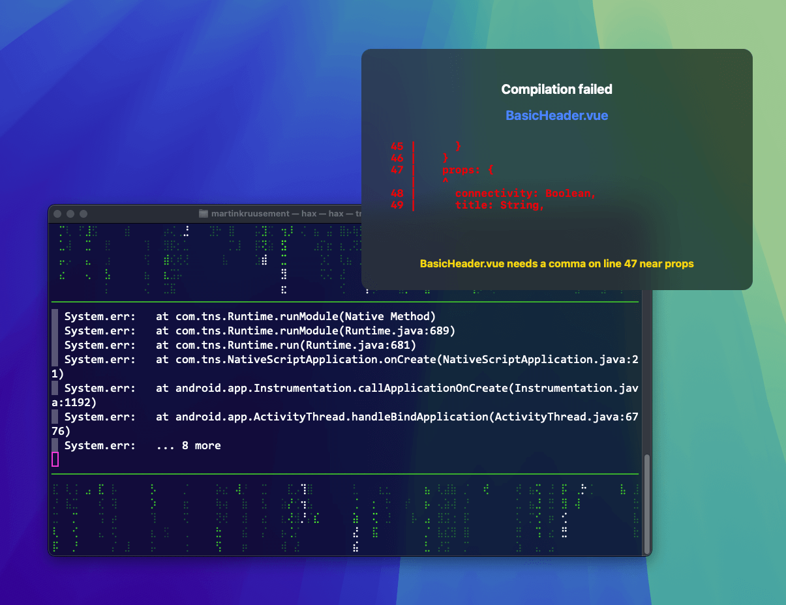

> [!WARNING]  
> This is an early version of an experimental plugin with _many bugs_.  
> **Do not** actually use it.

> [!WARNING]  
> MacOS only

> [!WARNING]  
> Will patch `webpack-log` to allow empty logGrup names

> [!WARNING]  
> The python script needs:  
> pip install pyaudio termcolor pydub simpleaudio elevenlabs


### The Swift binary for showing popups is included.  
**Rebuild with:**  
```bash
swiftc ErrorPopup.swift -o ErrorPopup
```
**Test with:**
```bash
./ErrorPopup 'Compilation failed' \
  '45 |      }\\n46 |    }\\n47 |    props: {\\n   |    ^\\n48 |      connectivity: Boolean,\\n49 |      title: String,' \
  'BasicHeader.vue needs a comma on line 47 near props' \
  'BasicHeader.vue' \
  '/Users/whomstve/projects/nzt48/src/components/ui/header' \
  20
```

## Configuration
```js
const WebpackErrorFormatterPlugin = require('error-helper-webpack-plugin/WebpackErrorFormatterPlugin.js')
/** @import {WebpackErrorFormatterPluginConf} from 'error-helper-webpack-plugin' */

  webpack.chainWebpack((config) => {
    /** @type {WebpackErrorFormatterPluginConf} */
    const errorHelperConfig = {
      tts: {
        active: true,
        engine: 'ElevenLabs', // 'ElevenLabs' needs an API key | 'local' uses "say 'What to say.'" builtin TTS engine on MacOS
        voiceId: '5izH2Qlr4ky45aDBTZE1', // Copy from Elevenlabs Voice details page
        apiKey: 'sk_000000000000000000000000000000000000000000000000' // from https://elevenlabs.io/app/settings/api-keys
        /* Setting these environment variables
           ELEVENLABS_API_KEY="..."
           ELEVENLABS_VOICE_ID="..."
           in the default Python env will also work
        */
      },
      log: {
        level: 'trace'
      },
      bail: true, // Stop compilation with process.exit
      debug: true, // Print more stuff
      popup: 5 // seconds, remove to disable
    }
    
    config.plugin('WebpackErrorFormatterPlugin').use(WebpackErrorFormatterPlugin, [errorHelperConfig])
  })
```

Or
```js
  plugins: [
    // ... Other plugins,
    new WebpackErrorFormatterPlugin(errorHelperConfig)
  ]
```
